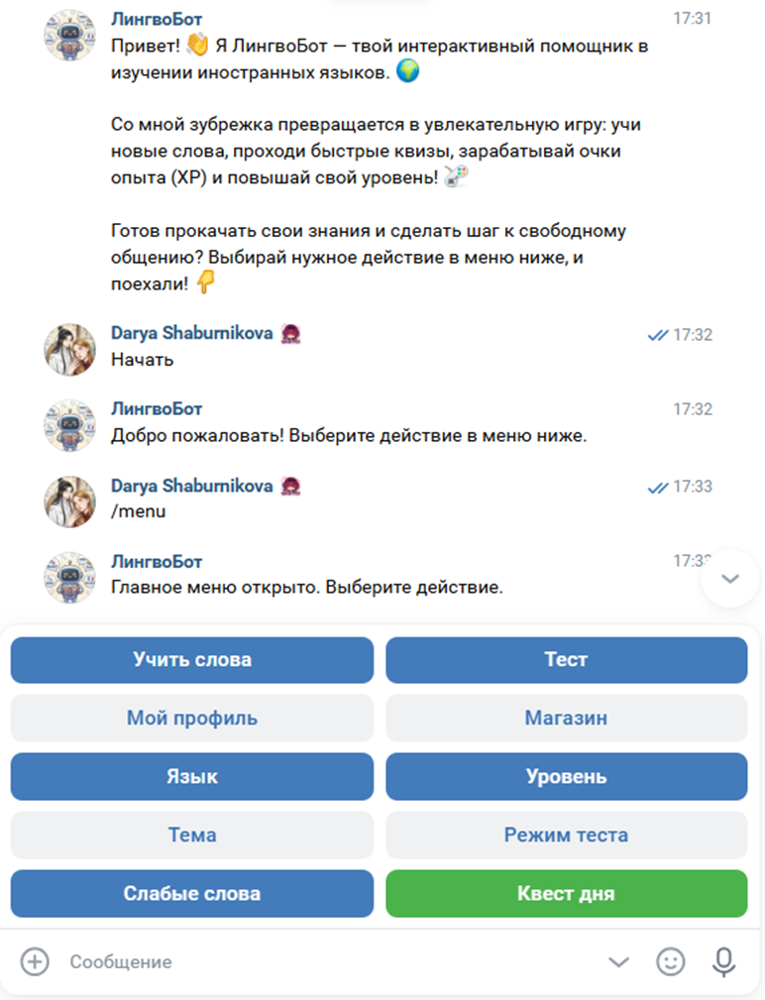
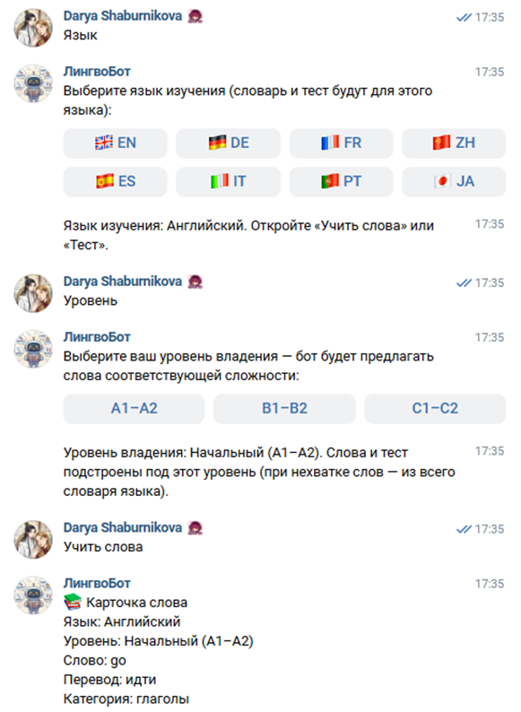
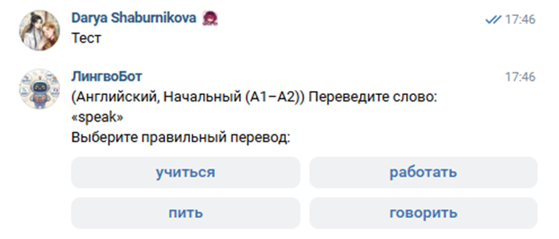
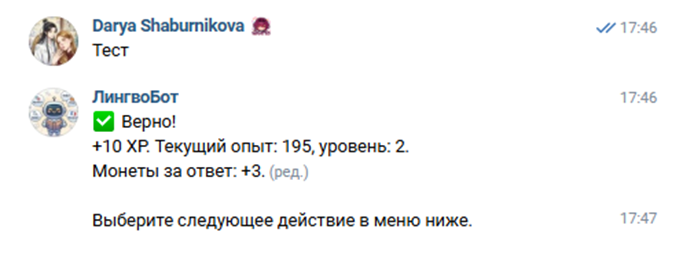
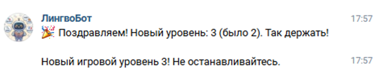
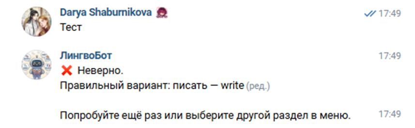
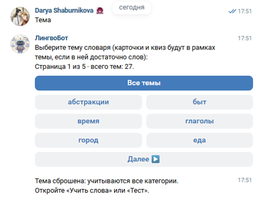
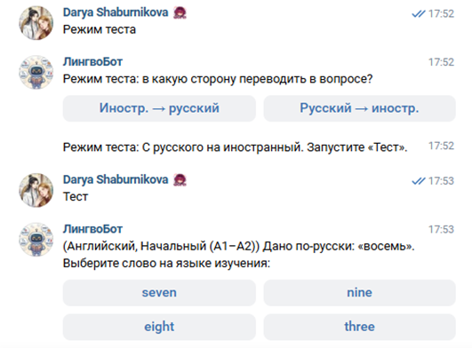
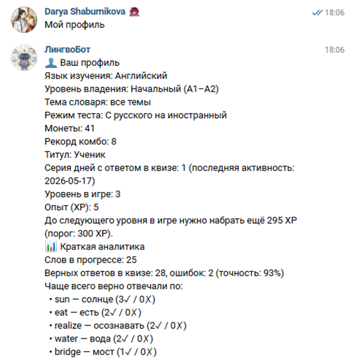

# ЛингвоБот (LingvoBot_VK)

Чат-бот ВКонтакте для изучения иностранных языков с элементами геймификации. Дипломный проект.

**Сообщество:** [ЛингвоБот]([https://vk.com/](https://vk.com/lingvo_bot_vk))  
**Репозиторий:** `https://github.com/dshabur/LingvoBot_VK`

---

## Описание

ЛингвоБот помогает учить лексику через карточки и мини-квизы в личных сообщениях сообщества ВК. Пользователь выбирает язык и уровень, проходит тесты, копит опыт (XP), монеты и игровой уровень. Реализованы темы словаря, режимы перевода, «слабые слова», ежедневные квесты, достижения и магазин усилений.



---

## Возможности

| Раздел | Описание |
|--------|----------|
| **Учить слова** | Карточки: слово, перевод, категория, уровень сложности |
| **Тест** | Квиз из 4 вариантов; умный подбор «слабых» слов по статистике |
| **Язык** | EN, DE, FR, ZH (мандарин, упрощ.), ES, IT, PT, JA |
| **Уровень** | A1–A2 / B1–B2 / C1–C2 |
| **Тема** | Фильтр по категориям словаря (27 тем, постраничное меню) |
| **Режим теста** | Иностранное → русский или русский → иностранное |
| **Слабые слова** | Квиз по словам с большим числом ошибок |
| **Профиль** | XP, уровень, монеты, серия дней, аналитика, титул |
| **Квест дня** | Случайное задание: карточки, верные ответы, комбо, быстрые ответы |
| **Магазин** | Подсказка (первая буква ответа), x2 XP на следующий верный ответ |



 

 







---

## Стек технологий

- **Python 3.10+**
- **VK API** — Long Poll API сообщества, `vk_api`
- **SQLite** — пользователи, словарь, прогресс, достижения
- **Docker** (опционально) — развёртывание на VPS

## Структура проекта

```
code/
├── main.py              # Точка входа, Long Poll, маршрутизация
├── config.py            # Токен, ID группы, путь к БД
├── db_handler.py        # Схема БД, CRUD, аналитика
├── game_logic.py        # XP, уровни, сборка квиза
├── gamification.py      # Квесты, достижения, магазин, комбо
├── keyboards.py         # Reply- и inline-клавиатуры
├── greetings.py         # Приветствия на разных языках
├── vocabulary_seed.py   # Словари EN, DE, FR
├── vocabulary_more.py   # ZH, ES, IT, PT, JA
├── vocabulary_extra.py  # Расширение словарей
├── load_test.py         # Нагрузочный тест логики
├── Dockerfile
├── docker-compose.yml
└── docs/screenshots/    # Скриншоты для README
```

---

## Быстрый старт

### 1. Требования

- Python 3.10 или новее
- Сообщество ВК с включёнными **сообщениями** и **Long Poll API**
- Ключ доступа с правами на сообщения

### 2. Установка

```bash
git clone https://github.com/dshabur/LingvoBot_VK.git
cd LingvoBot_VK
python -m venv .venv
# Windows:
.venv\Scripts\activate
# Linux/macOS:
# source .venv/bin/activate
pip install -r requirements.txt
```

### 3. Настройка

Скопируйте `.env.example` в `.env` и заполните:

| Переменная | Описание |
|------------|----------|
| `VK_GROUP_TOKEN` | Ключ доступа сообщества |
| `VK_GROUP_ID` | Числовой ID группы (из `club123456` → `123456`) |
| `DATABASE_PATH` | Необязательно; путь к файлу SQLite |

### 4. Запуск

```bash
python main.py
```

В диалоге с ботом: **Начать** или `/menu` — откроется главное меню.

> **Важно:** при запуске на локальном ПК бот не работает в режиме сна Windows. Для круглосуточной работы используйте VPS и Docker.

### 5. Docker

```bash
cp .env.example .env
# заполните .env
docker compose up -d --build
```

База сохраняется в томе `vkbot_sqlite`.

---

## Словарь

Для каждого языка в БД загружается **300+** записей (базовые модули + `vocabulary_extra`). Категории: еда, быт, глаголы, город, природа и др.

Перегенерация дополнительных слов:

```bash
python tools/build_romance_from_fr.py
python tools/generate_vocabulary_extra.py
```

---

## Команды бота

| Команда / кнопка | Действие |
|------------------|----------|
| Начать, `/start` | Регистрация, меню |
| `/menu` | Главное меню |
| Язык, `/lang` | Выбор языка |
| Уровень, `/level` | Уровень владения |
| Тема, `/theme` | Категория словаря |
| Режим теста, `/quizmode` | Направление перевода |
| Учить слова, `/learn` | Карточка |
| Тест, `/test` | Квиз |
| Слабые слова, `/weak` | Квиз по слабым словам |
| Мой профиль, `/profile` | Статистика |
| Квест дня, `/quest` | Ежедневное задание |
| Магазин, `/shop` | Покупка усилений |
| `/help` | Список команд |

---

## Нагрузочное тестирование

```bash
python load_test.py
```

---

## Лицензия

Учебный проект. При публикации укажите авторство и не выкладывайте `.env` с токеном.

## Автор

Шабурникова Дарья — дипломный проект, 2026.
